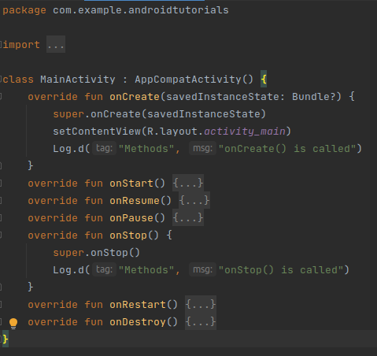

# Android Tutorials
Collection of code samples for learning Android Fundamentals and lessons in KOTLIN from [YOUTUBE](https://www.youtube.com/playlist?list=PLQkwcJG4YTCTq1raTb5iMuxnEB06J1VHX).

***
## The layout of Android Applications
Android applications have a strict layout. There are certain folders such as Manifest, JAVA folder, Res Folder, and Grade Scripts dedicated to their specific tasks.
- ### APP FOLDER
- 1. **Android Manifest** is the XML file that describes all the information needed from the app, the Android build tools, Android Operating System, and the Play Store. Android Manifest also contains the permission required by the app to perform its tasks. In addition to the information and permission, The XML file also stores the Hardware and Software features of the app. This helps determine the compatibility of the app in the play store.
   Other information stored in the file includes special activities like services, broadcast receivers, content providers, package names, etc.
- 2. **JAVA** Folder consists of all the required code files dedicated to performing specific tasks of the app. It is named Java, just for legacy purposes. The folder contains all the java and kotlin source code created during the app development.
- 3. **Res** Folder  consists of all the non-code files of the application such as Images, XML layouts, and UI strings for the android application. This makes it the most important among many. The Res folder consists of subfolders like drawable, layout, mipmap, raw, and values.
    - 1. **Drawable** consists of all the images used in Android Application.
    - 2. **Layout** Folder consists of all the XML files needed for properly working the Android application.
    - 3. **Mipmap** Folder of the Res folder consists of launcher.xml. The Launcher XML file is used to define icons on the home screen of phones and tablets. The Launcher has multiple density icons based on the size of the device screen.
    - 4. **Raw** Folder contains all the media files other than images such as audio files or music files. These can be accessed by syntax: R.raw.filename.
    - 5. **Values** Folder is used to store the values, colors, strings, integers, and more. 
- ### GRADLE SCRIPTS
   Gradle is storage for multiple build systems that when called can be applied to the app modules. The Gradle folder is independent of Android studio. They manage the entire build process. It provides processes and configuration settings specific to building and testing Android applications.
***
## Activity Lifecycle
- An activity is the single screen in android. It is like window or frame of Java. By the help of activity, you can place all your UI components or widgets in a single screen.
- It is basically a kotlin class combined with its xml layout and inside of that class we define how our specific screen should behave in which situations.
- All activities inherit from AppCompat Activity, which describes what an activity is, and we inherit from this class to take that behaviour and to make our activity out of that.
- As the user navigates between different screens or apps, it goes through different states in their lifecycle. So an activity lifecycle consists of 7 different methods of android.app.Activity class.

- You must be aware that a program starts from a main() function in different programming languages. Similarly, android initiates the program within an activity with a call to onCreate() callback method. There is a sequence of callback methods that starts up an activity and then tear down in different  methods shown in the above Activity life cycle diagram:
- Let’s understand these methods:
  - **onCreate()** :  In this state, the activity is created.
  - **onStart()** : This callback method is called when the activity becomes visible to the user.
  - **onResume()** : The activity is in the foreground and the user can interact with it.
  - **onPause()** : Activity is partially obscured by another activity. Other activity that’s in the foreground is semi-transparent.
  - **onStop()** : The activity is completely hidden and not visible to the user.
  - **onDestroy()** : Activity is destroyed and removed from the memory.
- **NOTE:** Whenever an activity is created it gets pushed to our activity stack and if a new activity is arrived it gets pushed on top of it, in that similar fashion they are popped out from the stack.
***
## Logcat
- Your best friend during android development.
- Console for android studio.
- LogCat Window is the place where various messages can be printed when an application runs. Suppose, you are running your application and the program crashes, unfortunately. Then, Logcat Window is going to help you to debug the output by collecting and viewing all the messages that your emulator throws. So, this is a very useful component for the app development because this Logcat dumps a lot of system messages and these messages are actually thrown by the emulator.
- There are lots of methods that are present in the log class:
  - v(String, String) - verbose
  - d(String, String) - debug
  - i(String, String) - information
  - w(String, String) - warning
  - e(String, String) - error
- The verbose method is of very lesser priority and error is of higher priority. Thus, the method’s priority increases from verbose to error.
- SYNTAX
  - for verbose Log.v("TAG", "MESSAGE")
  - for debug Log.d("TAG", "MESSAGE")
  - for information Log.i("TAG", "MESSAGE")
  - for warning Log.w("TAG", "MESSAGE")
  - for error Log.e("TAG", "MESSAGE")
***
## Activity Lifecycle practical with Logcat
- In your MainActivity override all the callback methods discussed above with **Log.d("Methods", "callbackName() is called")**
> Like this 

- Then in your logcat select Debug write your tag, and play around a bit.
***
## Views
- The most common type of element we’ll define in resources are Views. View is the superclass for visual interface elements—a visual component on the screen is a View. Specific types of Views include: TextViews, ImageViews, Buttons, etc.
- View is a superclass for these components because it allows us to use polymorphism to treat all these visual elements the same way as instances of the same type. We can lay them out, draw them, click on them, move them, etc. And all the behavior will be the same—though subclasses can also have “extra” features
Here’s the big trick: one subclass of View is ViewGroup. A ViewGroup can contain other “child” Views. But since ViewGroup is a View… it can contain more ViewGroups inside it! Thus we can nest Views within Views, following the Composite Pattern. This ends up working a lot like HTML (which can have DOM elements like 
 inside other DOM elements), allowing for complex user interfaces.
- Thus Views are structured into a tree, what is known as the View hierarchy.
     
* Views are defined inside of Layouts—that is, inside a layout resource, which is an XML file describing Views. These resources are “inflated” (rendered) into UI objects that are part of the application.
* Technically, Layouts are simply ViewGroups that provide “ordering” and “positioning” information for the Views inside of them. they let the system “lay out” the Views intelligently and effectively. Individual views shouldn’t know their own position; this follows from good object-oriented design and keeps the Views encapsulated.
* Android studio does come with a graphical Layout Editor (the “Design” tab) that can be used to create layouts. However, most developers stick with writing layouts in XML. This is mostly because early design tools were pathetic and unusable, so XML was all we had. Although Android Studio’s graphical editor can be effective, you should create layouts “by hand” in XML. This is helpful for making sure you understand the pieces underlying development, and is a skill you should be comfortable with anyway (similar to how we encourage people to use git from the command-line).
* XML namespaces are used for providing uniquely named elements and attributes in an XML document.
### View Properties
- All Views have properties which define the state of the View. Properties are usually defined within the resource XML as element attributes. Some examples of these property attributes are described below.
1. android:id specifies a unique identifier for the View. This identifier needs to be unique within the layout, though ideally is unique within the entire app (for clarity)
    - Identifiers must be legal Java variable names (because they are turned into a variable name in the R class), and by convention are named in lower_case format.
    - Style tip: it is useful to prefix each View’s id with its type (e.g., btn, txt, edt). This helps with making the code self-documenting.
    - You should give each interactive View a unique id, which will allow its state to automatically be saved as a Bundle when the Activity is destroyed.
2. android:layout_width and android:layout_height are used to specify the View’s size on the screen . These values can be a specific value (e.g., 12dp), but more commonly is one of two special values:
    - wrap_content, meaning the dimension should be as large as the content requires, plus padding.
    - match_parent, meaning the dimension should be as large as the parent (container) element, minus padding. This value was renamed from fill_parent (which has now been deprecated).
* Android utilizes the following dimensions or units:
   1. dp is a “density-independent pixel”. On a 160-dpi (dots-per-inch) screen, 1dp equals 1px (pixel). But as dpi increases, the number of pixels per dp increases. These values should be used instead of px, as it allows dimensions to work independent of the hardware’s dpi (which is highly variable).
   2. px is an actual screen pixel. DO NOT USE THIS (use dp instead!)
   3. sp is a “scale-independent pixel”. This value is like dp, but is scale by the system’s font preference (e.g., if the user has selected that the device should display in a larger font, 1sp will cover more dp). You should always use sp for text dimensions, in order to support user preferences and accessibility.
   4. pt is 1/72 of an inch of the physical screen. Similar units mm and in are available. Not recommended for use.
3. android:padding, android:paddingLeft, android:margin, android:marginLeft, etc. are used to specify the margin and padding for Views. These work basically the same way they do in CSS: padding is the space between the content and the “edge” of the View, and margin is the space between Views. Note that unlike CSS, margins between elements do not collapse.
4. android:textSize specifies the “font size” of textual Views (use sp units!), android:textColor specifies the color of text (reference a color resource!), etc.
* Note that unlike CSS, styling properties specified in the layout XML resources are not inherited; we’re effectively specifying an inline style attribute for that element, and one that won’t affect child elements. In order to define shared style properties, you’ll need to use styles resources.

* While it is possible to specify these visual properties dynamically via Java methods (e.g., setText(), setPadding()). You should only use Java methods to specify View properties when they need to be dynamic (e.g., the text changes in response to a button click)—it is much cleaner and effective to specify as much visual detail in the XML resource files as possible. It’s also possible to simply replace one layout resource with another (see below).
* Views also have inspection methods such as isVisible() and hasFocus().
* Do not define Views or View appearances in an Activity’s onCreate() callback, unless the properties (e.g., content) truly cannot be determined before runtime! Specify layouts in the XML instead.

## Layouts
- As mentioned above, a Layout is a grouping of Views (specifically, a ViewGroup). A Layout acts as a container for other Views, to help organize things. Since Android runs on a variety of screen sizes, your layout have to be as responsive a s possible. We don’t tell the exact positions of the views on the screen, instead we describe the relations between different views using layouts. Layouts are all subclasses of ViewGroup, so you can use its inheritance documentation to see a (mostly) complete list of options, though many of the listed classes are deprecated in favor of later, more generic/powerful options.
### 1. LinearLayout
- Probably the simplest Layout to understand is the LinearLayout. This Layout simply orders the children View in a line (“linearly”). All children are laid out in a single direction, but you can specify whether this is horizontal or vertical with the android:orientation property.
- Remember: since a Layout is a ViewGroup is a View, you can also utilize all the properties discussed above; the attributes are inherited!
- Another common property you might want to control in a LinearLayout is how much of any remaining space the elements should occupy (e.g., should they expand). This is done with the android:layout_weght property. After all element sizes are calculated (via their individual properties), the remaining space within the Layout is divided up proportionally to the layout_weight of each element (which defaults to 0 so they get no extra space). See the example in the guide for more details.
- Useful tip: Give elements 0dp width or height and 1 for weight to make everything in the Layout the same size!
- You can also use the android:layout_gravity property to specify the “alignment” of elements within the Layout (e.g., where they “fall” to). Note that this property is specified on individual child Views.
- An important point Since Layouts are Views, you can of course nest LinearLayouts inside each other! So you can make “grids” by creating a vertical Layout containing “rows” of horizontal Layouts (which contain Views). As with HTML, there are lots of different options for achieving any particular interface layout.
### 2. RelativeLayout
- A RelativeLayout is more flexible (and hence powerful), but can be more complex to use. In a RelativeLayout, children are positioned “relative” to the parent OR to each other. All children default to the top-left of the Layout, but you can give them properties from RelativeLayout.LayoutParams to specify where they should go instead.
- For example: android:layout_verticalCenter centers the View vertically within the parent. android:layout_toRightOf places the View to the right of the View with the given resource id (use an @ reference to refer to the View by its id):

- `<TextView
android:id="@+id/first"
android:layout_width="match_parent"
android:layout_height="wrap_content"
android:text="FirstString" />
<TextView
android:id="@+id/second"
android:layout_height="wrap_content"
android:layout_below="@id/first"
android:layout_alignParentLeft="true"
android:text="SecondString" />
`
- (Recall that the @+ syntax defines a new View id, like declaring a variable!)
- You do not need to specify both toRightOf and toLeftOf; think about placing one element on the screen, then putting another element relative to what came before. This can be tricky. For this reason the author prefers to use LinearLayouts, since you can always produce a Relative positioning using enough LinearLayouts (and most layouts end up being linear in some fashion anyway!)
### 3. ConstraintLayout
- ConstraintLayout is a Layout provided as part of an extra support library, and is what is used by Android Studio’s “Design” tool (and thus is the default Layout for new layout resources). ConstraintLayout works in a manner conceptually similar to RelativeLayout, in that you specify the location of Views in relationship to one another. However, ConstraintLayout offers a more powerful set of relationships in the form of constraints, which can be used to create highly responsive layouts. See the class documentation for more details and examples of constraints you can add.
- The main advantage of ConstraintLayout is that it supports development through Android Studio’s Design tool. However, since this course is focusing on implementing the resource XML files rather than using the specific tool (that may change in a year’s time), we will primarily be using other layouts.
### 4. Other Layouts
- There are many other layouts as well, though we won’t go over them all in depth. They all work in similar ways; check the individual class’s documentatoion for details. 
  1. FrameLayout is a sort of “placeholder” layout that holds a single child View (a second child will not be shown). You can think of this layout as a way of adding a simple container to use for padding, etc. It is also highly useful for situations where the framework requires you to specify a Layout resource instead of just an individual View.
  2. GridLayout arranges Views into a Grid. It is similar to LinearLayout, but places elements into a grid rather than into a line.
     - Note that this is different than a Grid_View_, which is a scrollable, adaptable list (similar to a ListView, which is discussed in the next lecture).
  3. TableLayout acts like an HTML table: you define TableRow layouts which can be filled with content. This View is not commonly used.
## Some Common Views
### 1. open class Button : TextView
- In Android applications, a Button is a user interface that is used to perform some action when clicked or tapped. It is a very common widget in Android and developers often use it. You can attach onClickListener on any kind of view, so you can listen to on click events.
### 2. open class TextView : View, ViewTreeObserver.OnPreDrawListener
- A user interface element that displays text to the user. To provide user-editable text, use EditText. Some attr: ellipseSize and lines
### 3. open class ImageView : View
- Displays image resources, for example android.graphics.Bitmap or android.graphics.drawable.Drawable resources. ImageView is also commonly used to apply tints to an image and handle image scaling. Some attr: tint, scaleType, src
### 4. open class RadioGroup : LinearLayout
- This class is used to create a multiple-exclusion scope for a set of radio buttons. Checking one radio button that belongs to a radio group unchecks any previously checked radio button within the same group.Initially, all of the radio buttons are unchecked. While it is not possible to uncheck a particular radio button, the radio group can be cleared to remove the checked state. The selection is identified by the unique id of the radio button as defined in the XML layout file (.checkedRadioButtonId -> gets you currently checkedID from the radio group).
###5. open class CheckBox : CompoundButton
- A checkbox is a specific type of two-states button that can be either checked or unchecked.
***
